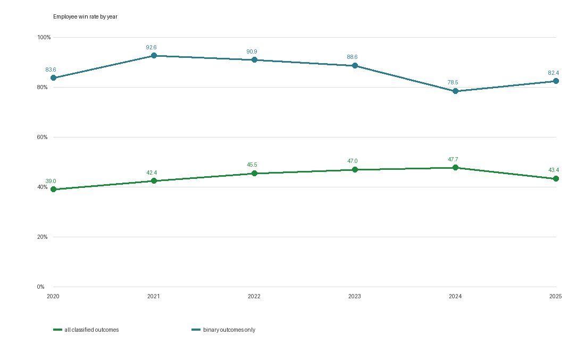
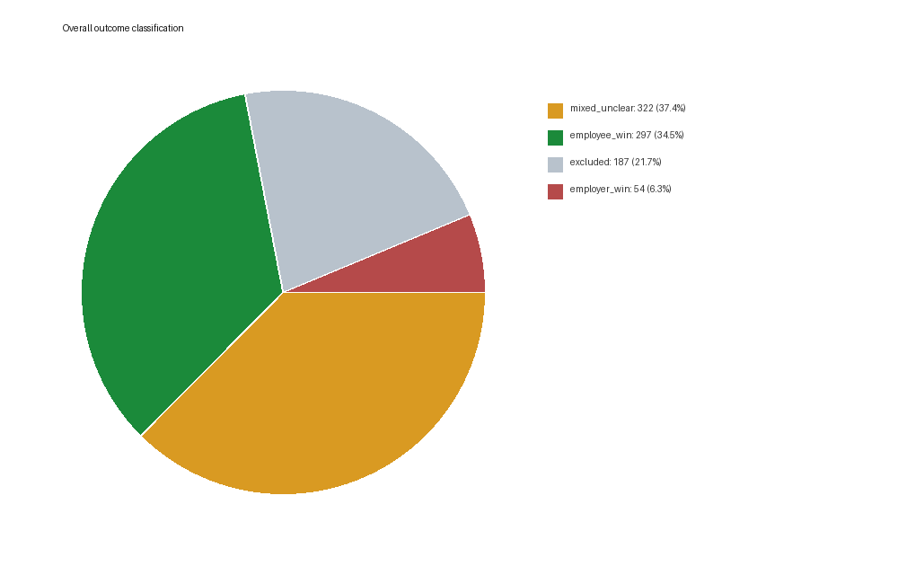
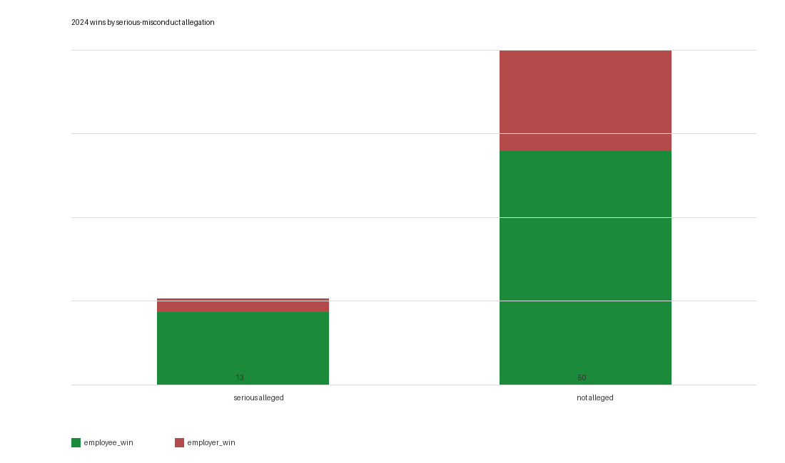
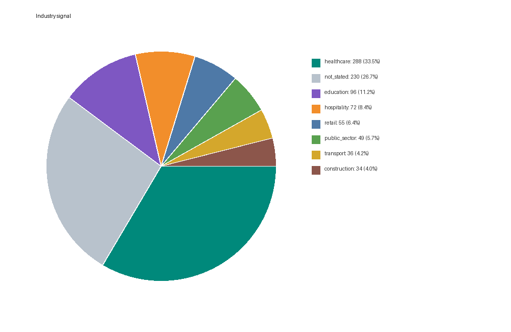
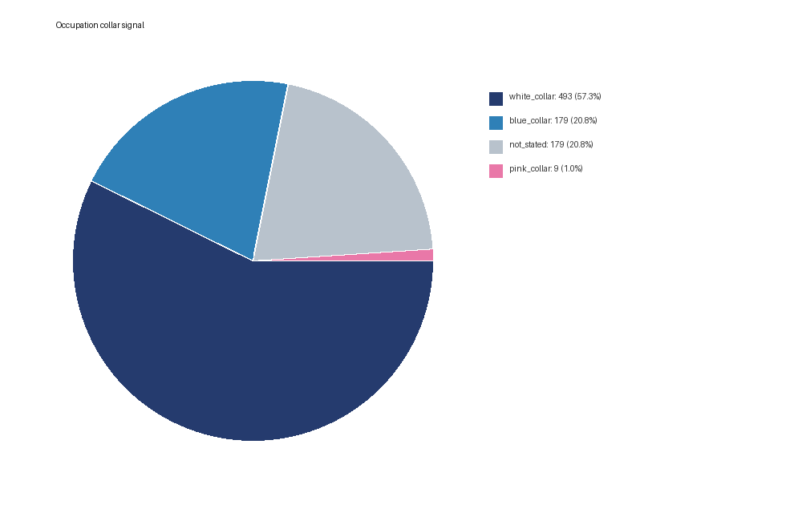

# NZ ERA dismissal decisions

What happens when New Zealand employees challenge dismissal at the Employment
Relations Authority?

This project downloads the public ERA decisions, classifies the outcomes, and
keeps the evidence in auditable CSV files.

## The headline

In the reviewed 2024 baseline, employees won **46 of 63 cases (73.0%)**.
Removing cases where the ERA confirmed serious misconduct: **46 of 61
(75.4%)**.

### Employee win rate



Green is the all-outcome rate; teal counts only clear employee/employer wins.

### The outcome mix



### Serious misconduct: 2024



### Where the cases sit





## Use it

```bash
python3 analyze_era.py --root years/2026 --year 2026
python3 combine_years.py
python3 enrich_context.py
python3 make_charts.py
pytest -q tests/test_analyze_era.py
```

The full method, field definitions, limitations, and audit trail are in
[`TECHNICAL.md`](TECHNICAL.md).

Source decisions: [New Zealand ERA database](https://determinations.era.govt.nz/).
