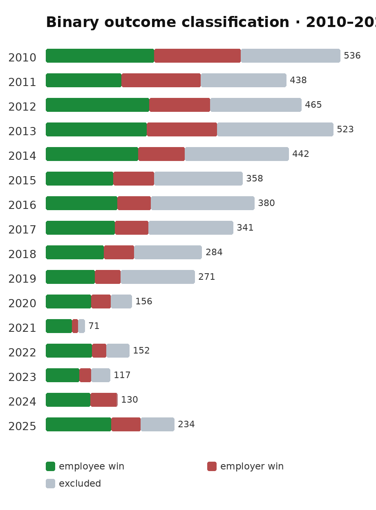
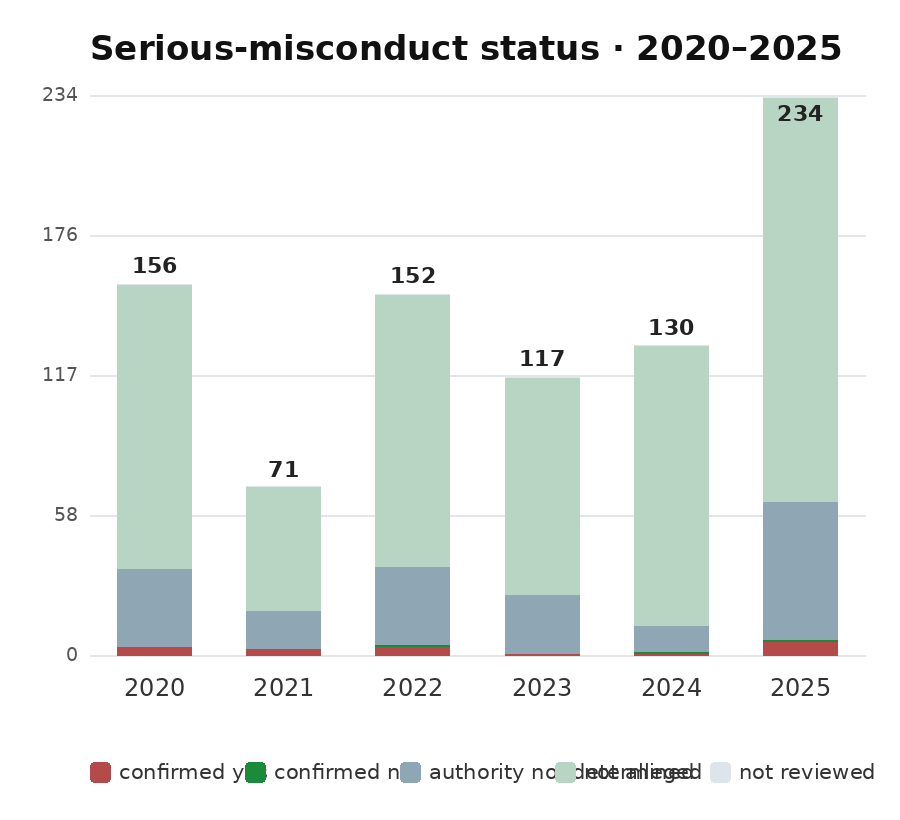

# NZ ERA dismissal decisions — 2025

What happened when New Zealand employees challenged dismissal at the Employment
Relations Authority in 2025?

This project downloads public ERA decisions, reads each determination's operative
findings/conclusion/orders for classification, and keeps the resulting evidence
in auditable CSV files. The current README highlights the most recent completed
search: **2025**.



*2025 is the largest search cohort shown. Its substantial mixed/unclear segment
is retained instead of being forced into a binary employee or employer result.*

## Completed 2010–2019 strict classification

The ten-year legacy extension is now complete. All **4,038 unique determinations**
from 2010–2019 have a final category and outcome after an operative-findings pass
plus a **345-case strict second audit** of higher-risk classifications.

- **2,373** substantive dismissal-merits determinations
- **1,449** employee wins
- **924** employer wins
- **1,665** excluded non-merits determinations
- **61.1%** employee-win rate among substantive dismissal merits

Read the [2010–2019 strict report](output/LEGACY_2010_2019_STRICT_REPORT.md) or
inspect the [combined 4,038-row classification](output/combined_2010_2019_strict_classification.csv).
Each legacy year also has its own `years/YYYY/output/YYYY_strict_classification.csv`.

## 2025 results

The official 2025 search returned **234 unique PDFs**. Following the initial
routing, **173 possible merits determinations** are included in the review
denominator. The remaining decisions were excluded as 34 costs/follow-up, 24
procedural/interlocutory, 2 compliance/removal, and 1
withdrawal/non-prosecution determination.

| Outcome | Cases |
|---|---:|
| Employee win | 75 |
| Employer win | 16 |
| Mixed/unclear | 82 |

The employee-win rate is **43.4%** across all 173 merits rows, or **82.4%**
among the 91 clear employee/employer outcomes. The difference is a useful
reminder that the headline depends on whether mixed and unclear determinations
are included.

Read the full 2025 report: [2025 categorized results](years/2025/output/2025_final_report.md).

## Important interpretation note

The 2025 file deliberately preserves mixed and unclear outcomes rather than
forcing a binary result. Serious-misconduct labels are only final when supported
by the Authority's operative findings; employer allegations alone are not
sufficient.

## Supporting charts

### Win-rate comparison


*Green shows all classified outcomes; blue shows only clear employee/employer
outcomes.*

### Overall outcome mix


### Serious-misconduct status



### Case context


## Project outputs

- [2010–2019 strict report](output/LEGACY_2010_2019_STRICT_REPORT.md)
- [2010–2019 combined strict classification](output/combined_2010_2019_strict_classification.csv)
- [2025 categorized decisions](years/2025/output/2025_final_categorized.csv)
- [2025 review queue](years/2025/output/2025_categorized_review_queue.csv)
- [2025 initial extraction](years/2025/output/initial_extraction.csv)
- [Combined 2020–2025 report](output/final_report.md)

## Reproduce or extend

```bash
python3 analyze_era.py --root years/2026 --year 2026
python3 combine_years.py
python3 enrich_context.py
python3 make_charts.py
pytest -q tests/test_analyze_era.py
```

The completed legacy classification can be re-materialized from its acquisition
inputs with `python3 finalize_legacy_strict.py --root .`.

Agents extending the dataset must complete the per-determination classification
themselves rather than stopping at generated review queues. The full method,
field definitions, limitations, and audit trail are in [TECHNICAL.md](TECHNICAL.md).
Source decisions: [New Zealand ERA database](https://determinations.era.govt.nz/).
